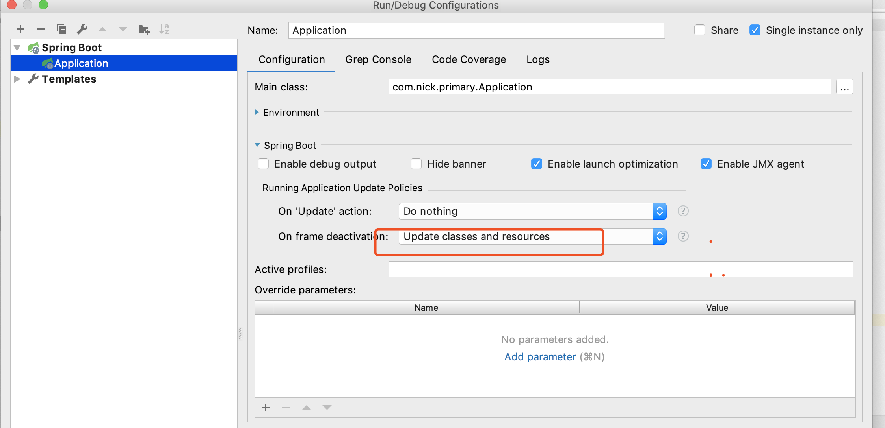

* 导入devtools依赖  

```xml
		<dependency>
			<groupId>org.springframework.boot</groupId>
			<artifactId>spring-boot-devtools</artifactId>
		</dependency>
```

* 编译当前工程运行配置配置信息,on frame deactivation.



* idea没有保存键，当窗口切换的时候会自动加载。

